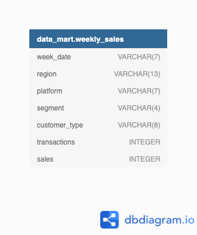

<div align="center">

# Case Study #5 - Date Bank </br>


</div>

## 💡 Informacje

W folderze _solutions_ znajdują się pliki z rozwiązaniami w SQL.</br>
Do wykonania wykorzystany został SQL oraz PostgreSQL.</br>
Szczegółowe informacje dotyczące tego studium przypadku znajdują się [tutaj](https://8weeksqlchallenge.com/case-study-5/).

## 📋 Spis treści

- [Opis](#-opis)
- [Diagram relacji](#-diagram-relacji)
- [Rozwiązanie: 1. Data Cleansing Steps](#️-1-data-cleaning)
- [Rozwiązanie: 2. Data Exploration](#️-2-data-exploration)
  - [1. What day of the week is used for each week_date value?](#1-what-day-of-the-week-is-used-for-each-week_date-value)
  - [2. What range of week numbers are missing from the dataset?](#2-what-range-of-week-numbers-are-missing-from-the-dataset)
  - [3. How many total transactions were there for each year in the dataset?](#3-how-many-total-transactions-were-there-for-each-year-in-the-dataset)
  - [4. What is the total sales for each region for each month?](#4-what-is-the-total-sales-for-each-region-for-each-month)
  - [5. What is the total count of transactions for each platform](#5-what-is-the-total-count-of-transactions-for-each-platform)
  - [6. What is the percentage of sales for Retail vs Shopify for each month?](#6-what-is-the-percentage-of-sales-for-retail-vs-shopify-for-each-month)
  - [7. What is the percentage of sales by demographic for each year in the dataset?](#7-what-is-the-percentage-of-sales-by-demographic-for-each-year-in-the-dataset)
  - [8. Which age_band and demographic values contribute the most to Retail sales?](#8-which-age_band-and-demographic-values-contribute-the-most-to-retail-sales)
  - [9. Can we use the avg_transaction column to find the average transaction size for each year for Retail vs Shopify?](#9-can-we-use-the-avg_transaction-column-to-find-the-average-transaction-size-for-each-year-for-retail-vs-shopify-if-not---how-would-you-calculate-it-instead)
- [Rozwiązanie: 3. Before & After Analysis](#️-3-before--after-analysis)
  - [1. What is the total sales for the 4 weeks before and after 2020-06-15? What is the growth or reduction rate in actual values and percentage of sales?](#1-what-is-the-total-sales-for-the-4-weeks-before-and-after-2020-06-15-what-is-the-growth-or-reduction-rate-in-actual-values-and-percentage-of-sales)
  - [2. What about the entire 12 weeks before and after?](#2-what-about-the-entire-12-weeks-before-and-after)
  - [3. How do the sale metrics for these 2 periods before and after compare with the previous years in 2018 and 2019?](#3-how-do-the-sale-metrics-for-these-2-periods-before-and-after-compare-with-the-previous-years-in-2018-and-2019)

## 🔍 Opis

### Wprowadzenie

Data Mart to najnowsze przedsięwzięcie Danny’ego i po prowadzeniu międzynarodowych operacji dla swojego supermarketu internetowego, który specjalizuje się w świeżych produktach - Danny prosi o wsparcie w celu analizy jego wyników sprzedaży.

### Problem

Kluczowe pytania biznesowe, na które chce, abyś pomógł mu odpowiedzieć, to:

- Jaki był wymierny wpływ zmian wprowadzonych w czerwcu 2020 r.?
- Na którą platformę, region, segment i typy klientów najbardziej wpłynęła ta zmiana?
- Co możemy zrobić w związku z przyszłym wprowadzeniem do firmy podobnych aktualizacji zrównoważonego rozwoju, aby zminimalizować wpływ na sprzedaż?

## 📈 Diagram relacji

<div align=center>

</div>

Tabela: `weekly_sales`

| week_date |    region     | platform | segment | customer_type | transactions |   sales    |
| :-------: | :-----------: | :------: | :-----: | :-----------: | :----------: | :--------: |
|  9/9/20   |    OCEANIA    | Shopify  |   C3    |      New      |     610      | 110033.89  |
|  29/7/20  |    AFRICA     |  Retail  |   C1    |      New      |    110692    | 3053771.19 |
|  22/7/20  |    EUROPE     | Shopify  |   C4    |   Existing    |      24      |  8101.54   |
|  13/5/20  |    AFRICA     | Shopify  |  null   |     Guest     |     5287     | 1003301.37 |
|  24/7/19  |     ASIA      |  Retail  |   C1    |      New      |    127342    | 3151780.41 |
|  10/7/19  |    CANADA     | Shopify  |   F3    |      New      |      51      |  8844.93   |
|  26/6/19  |    OCEANIA    |  Retail  |   C3    |      New      |    152921    | 5551385.36 |
|  29/5/19  | SOUTH AMERICA | Shopify  |  null   |      New      |      53      |  10056.2   |
|  22/8/18  |    AFRICA     |  Retail  |  null   |   Existing    |    31721     | 1718863.58 |
|  25/7/18  | SOUTH AMERICA |  Retail  |  null   |      New      |     2136     |  81757.91  |

## ⚙️ 1. Data Cleaning

| Nazwa kolumny    | Transformacja                                                                        |
| ---------------- | ------------------------------------------------------------------------------------ |
| week_date        | Zmiana typu na `DATE`                                                                |
| week_number      | Wyodrębnienie z `week_date` numeru tygodnia                                          |
| month_number     | Wyodrębnienie z `week_date` numeru miesiąca                                          |
| calendar_year    | Wyodrębnienie z `week_date` roku                                                     |
| region           | Bez zmian                                                                            |
| platform         | Bez zmian                                                                            |
| segment          | Bez zmian                                                                            |
| age_band         | Na podstawie wartości `segment` przypisanie przedziału wiekowego                     |
| demographic      | Na podstawie wartości `segment` przypisanie kategorii demograficznej                 |
| customer_type    | Bez zmian                                                                            |
| transactions     | Bez zmian                                                                            |
| avg_transactions | Wartość `sales` podzielona przez `transactions` zaokrąglone do 2 miejsc po przecinku |
| sales            | Bez zmian                                                                            |

```sql

CREATE TABLE clean_weekly_sales as(
    SELECT
        week_date::date,
        DATE_PART('week', week_date::date) as week_number,
        DATE_PART('month', week_date::date) as month_number,
        DATE_PART('year', week_date::date) as calendar_year,
        region,
        platform,
        CASE
            WHEN segment LIKE 'null' THEN 'unkown'
            ELSE segment
        END as segment,
        CASE
            WHEN segment LIKE '%1' THEN 'Young Adults'
            WHEN segment LIKE '%2' THEN 'Middle Aged'
            WHEN segment LIKE '%3' OR segment LIKE '%4' THEN 'Retirees'
            ELSE 'unknown'
        END as age_band,
        CASE
            WHEN segment LIKE 'C%' THEN 'Couples'
            WHEN segment LIKE 'F%' THEN 'Families'
            ELSE 'unknown'
        END as demographic,
        customer_type,
        transactions,
        ROUND(sales::NUMERIC / transactions, 2) as avg_transaction,
        sales
    FROM weekly_sales
);
```

## ⚙️ 2. Data Exploration

### 1. What day of the week is used for each week_date value?

_Który dzień tygodnia jest używany dla każdej wartości week_date?_

```sql
SELECT
    to_char(week_date, 'Day') as week_day,
    COUNT(*)
FROM clean_weekly_sales
GROUP BY week_day;
```

#### Wynik zapytania/Odpowiedź:

| week_day | count |
| :------: | :---: |
|  Monday  | 17117 |

---

### 2. What range of week numbers are missing from the dataset?

_Jaki zakres numerów tygodniowych brakuje w zestawie danych?_

```sql
WITH number_generate_cte AS(
    SELECT
        GENERATE_SERIES(1,52) as all_week_numbers
)

SELECT
    DISTINCT all_week_numbers as missing_week_numbers
FROM number_generate_cte
LEFT JOIN clean_weekly_sales
   ON clean_weekly_sales.week_number = number_generate_cte.all_week_numbers
WHERE week_number IS NULL;
```

#### Wynik zapytania/Odpowiedź:

| missing_week_numbers |
| :------------------: |
|          1           |
|          2           |
|          3           |
|          4           |
|          5           |
|          6           |
|          7           |
|          8           |
|          9           |
|          10          |
|          11          |
|          12          |
|          37          |
|          38          |
|          39          |
|          40          |
|          41          |
|          42          |
|          43          |
|          44          |
|          45          |
|          46          |
|          47          |
|          48          |
|          49          |
|          50          |
|          51          |
|          52          |

---

### 3. How many total transactions were there for each year in the dataset?

_Ile transakcji łącznie odnotowano w każdym roku w zbiorze danych?_

```sql
SELECT
    calendar_year,
    SUM(transactions) as total_transactions
FROM clean_weekly_sales
GROUP BY calendar_year;
```

#### Wynik zapytania/Odpowiedź:

| calendar_year | total_transactions |
| :-----------: | :----------------: |
|     2018      |     346406460      |
|     2020      |     375813651      |
|     2019      |     365639285      |

---

### 4. What is the total sales for each region for each month?

_Jaka jest całkowita sprzedaż w każdym regionie w każdym miesiącu?_

```sql
SELECT
    region,
    month_number,
    SUM(sales) as total_sales
FROM clean_weekly_sales
GROUP BY region, month_number
ORDER BY month_number, region;
```

#### Wynik zapytania/Odpowiedź:

|    region     | month_number | total_sales |
| :-----------: | :----------: | :---------: |
|    AFRICA     |      3       |  567767480  |
|     ASIA      |      3       |  529770793  |
|    CANADA     |      3       |  144634329  |
|    EUROPE     |      3       |  35337093   |
|    OCEANIA    |      3       |  783282888  |
| SOUTH AMERICA |      3       |  71023109   |
|      USA      |      3       |  225353043  |

Ze względu na długą tablicę, podglądowe wyniki są jedynie dla marca.

---

### 5. What is the total count of transactions for each platform

_Jaka jest łączna liczba transakcji dla każdej platformy?_

```sql
SELECT
    platform,
    SUM(transactions) as total_transactions
FROM clean_weekly_sales
GROUP BY platform;
```

#### Wynik zapytania/Odpowiedź:

| platform | total_transactions |
| :------: | :----------------: |
| Shopify  |      5925169       |
|  Retail  |     1081934227     |

---

### 6. What is the percentage of sales for Retail vs Shopify for each month?

_Jaki jest procent sprzedaży detalicznej w porównaniu do Shopify w poszczególnych miesiącach?
_

```sql
WITH monthly_total_sales_cte AS(
    SELECT
        month_number,
        calendar_year,
        SUM(sales) as sales_in_month
    FROM clean_weekly_sales
    GROUP BY month_number, calendar_year
),
total_platform_sales_cte AS(
    SELECT
        platform,
        month_number,
        calendar_year,
        SUM(sales) as total_sales
    FROM clean_weekly_sales
    GROUP BY platform, month_number, calendar_year
)

SELECT
    platform,
    tps_cte.calendar_year,
    tps_cte.month_number,
    ROUND(total_sales * 100.00 /sales_in_month, 2) as platform_sales_percentage
FROM total_platform_sales_cte as tps_cte
LEFT JOIN monthly_total_sales_cte
    ON tps_cte.month_number = monthly_total_sales_cte.month_number
    AND tps_cte.calendar_year = monthly_total_sales_cte.calendar_year
ORDER BY tps_cte.calendar_year, tps_cte.month_number;
```

#### Wynik zapytania/Odpowiedź:

| platform | calendar_year | month_number | platform_sales_percentage |
| :------: | :-----------: | :----------: | :-----------------------: |
| Shopify  |     2018      |      3       |           2.08            |
|  Retail  |     2018      |      3       |           97.92           |
|  Retail  |     2018      |      4       |           97.93           |
| Shopify  |     2018      |      4       |           2.07            |
| Shopify  |     2018      |      5       |           2.27            |
|  Retail  |     2018      |      5       |           97.73           |
| Shopify  |     2018      |      6       |           2.24            |
|  Retail  |     2018      |      6       |           97.76           |
|  Retail  |     2018      |      7       |           97.75           |
| Shopify  |     2018      |      7       |           2.25            |
|  Retail  |     2018      |      8       |           97.71           |
| Shopify  |     2018      |      8       |           2.29            |
| Shopify  |     2018      |      9       |           2.32            |
|  Retail  |     2018      |      9       |           97.68           |

Wiersze z danymi jedynie na rok 2018.

---

### 7. What is the percentage of sales by demographic for each year in the dataset?

_Jaki jest procent sprzedaży według grup demograficznych w każdym roku?_

```sql
WITH year_sales_cte AS(
    SELECT
        calendar_year,
        SUM(sales) as total_year_sales
    FROM clean_weekly_sales
    GROUP BY calendar_year
),
total_demographic_sales_cte AS(
    SELECT
        calendar_year,
        demographic,
        SUM(sales) as demographic_sales
    FROM clean_weekly_sales
    GROUP BY calendar_year, demographic
)

SELECT
    tds_cte.calendar_year,
    demographic,
    ROUND(demographic_sales * 100.00 / total_year_sales, 2) as demographic_sales_percentage
FROM total_demographic_sales_cte as tds_cte
LEFT JOIN year_sales_cte
    ON tds_cte.calendar_year = year_sales_cte.calendar_year
ORDER BY tds_cte.calendar_year, demographic;
```

#### Wynik zapytania/Odpowiedź:

| calendar_year | demographic | demographic_sales_percentage |
| :-----------: | :---------: | :--------------------------: |
|     2018      |   Couples   |            26.38             |
|     2018      |  Families   |            31.99             |
|     2018      |   unknown   |            41.63             |
|     2019      |   Couples   |            27.28             |
|     2019      |  Families   |            32.47             |
|     2019      |   unknown   |            40.25             |
|     2020      |   Couples   |            28.72             |
|     2020      |  Families   |            32.73             |
|     2020      |   unknown   |            38.55             |

---

### 8. Which 'age_band' and 'demographic' values contribute the most to Retail sales?

_Które wartości „age_band” i „demographic” mają największy wpływ na sprzedaż Retail?_

```sql
SELECT
    age_band,
    demographic,
    SUM(sales) as total_sales,
    ROUND(SUM(sales) * 100.00 / SUM(SUM(sales)) OVER(), 2) as sales_percentage
FROM clean_weekly_sales
GROUP BY age_band, demographic
ORDER BY total_sales DESC;
```

#### Wynik zapytania/Odpowiedź:

|   age_band   | demographic | total_sales | sales_percentage |
| :----------: | :---------: | :---------: | :--------------: |
|   unknown    |   unknown   | 16338612234 |      40.10       |
|   Retirees   |  Families   | 6750457132  |      16.57       |
|   Retirees   |   Couples   | 6531115070  |      16.03       |
| Middle Aged  |  Families   | 4556141618  |      11.18       |
| Young Adults |   Couples   | 2679593130  |       6.58       |
| Middle Aged  |   Couples   | 1990499351  |       4.89       |
| Young Adults |  Families   | 1897215692  |       4.66       |

---

### 9. Can we use the avg_transaction column to find the average transaction size for each year for Retail vs Shopify? If not - how would you calculate it instead?

_Czy możemy użyć kolumny avg_transaction, aby znaleźć średnią wielkość transakcji w danym roku dla Retail i Shopify? Jeśli nie, jak ją obliczyć?_

```sql
SELECT
    calendar_year,
    platform,
    SUM(sales) / SUM(transactions) as avg_transactions_calc,
    ROUND(AVG(avg_transaction),0) as avg_transactions_row
FROM clean_weekly_sales
GROUP BY calendar_year, platform
ORDER BY calendar_year, platform;
```

#### Wynik zapytania/Odpowiedź:

| calendar_year | platform | avg_transactions_calc | avg_transactions_row |
| :-----------: | :------: | :-------------------: | :------------------: |
|     2018      |  Retail  |          36           |          43          |
|     2018      | Shopify  |          192          |         188          |
|     2019      |  Retail  |          36           |          42          |
|     2019      | Shopify  |          183          |         178          |
|     2020      |  Retail  |          36           |          41          |
|     2020      | Shopify  |          179          |         175          |

Aby obliczyć średnią wielkość transakcji podzieliłam całkowitą kwotą przez całkowitą liczbę transakcji, w przypadku użycia kolumny `avg_transaction` użyłam funkcji AVG(). Wyniki są podobne, ale nie takie same.</br>
Do obliczenia prawdziwej średniej kwoty transakcji lepiej użyć pierwszego sposobu.

---

## ⚙️ 3. Before & After Analysis

### 1. What is the total sales for the 4 weeks before and after 2020-06-15? What is the growth or reduction rate in actual values and percentage of sales?

_Jaka jest całkowita sprzedaż za 4 tygodnie przed i po 15.06.2020 r.? Jaki jest wskaźnik wzrostu lub spadku rzeczywistych wartości i procent sprzedaży?_

```sql
--- znalezienie numeru tygodnia, dla daty '2020-06-15'
SELECT
    DISTINCT week_number
FROM clean_weekly_sales
WHERE week_date = '2020-06-15'

--- rozwiązanie zadania

WITH total_sales_week_cte AS(
    SELECT
        week_date,
        week_number,
        SUM(sales) as total_sales
    FROM clean_weekly_sales
    WHERE (week_number BETWEEN 21 AND 28)
        AND calendar_year = 2020
    GROUP BY week_date, week_number
),
before_after_date_cte AS(
    SELECT
        SUM(CASE
            WHEN week_number BETWEEN 21 AND 24 THEN total_sales
        END) as before_date,
        SUM(CASE
            WHEN week_number BETWEEN 25 AND 28 THEN total_sales
        END) as after_date
    FROM total_sales_week_cte
)

SELECT
    after_date - before_date AS sales_diff,
    ROUND((after_date - before_date) * 100 / before_date, 2) as diff_percentage
FROM before_after_date_cte;
```

#### Wynik zapytania/Odpowiedź:

| week_number |
| :---------: |
|     25      |

---

| sales_diff | diff_percentage |
| :--------: | :-------------: |
| -26884188  |      -1.15      |

Od czasu wdrożenia widać spadek sprzedaży o $26 884 188, czyli 1,15%.

---

### 2. What about the entire 12 weeks before and after?

_A co z całym okresem 12 tygodni przed i po?_

```sql
WITH total_sales_week_cte AS(
    SELECT
        week_date,
        week_number,
        SUM(sales) as total_sales
    FROM clean_weekly_sales
    WHERE (week_number BETWEEN 13 AND 36)
        AND calendar_year = 2020
    GROUP BY week_date, week_number
),
before_after_date_cte AS(
    SELECT
        SUM(CASE
            WHEN week_number BETWEEN 13 AND 24 THEN total_sales
        END) as before_date,
        SUM(CASE
            WHEN week_number BETWEEN 25 AND 36 THEN total_sales
        END) as after_date
    FROM total_sales_week_cte
)

SELECT
    after_date - before_date AS sales_diff,
    ROUND((after_date - before_date) * 100 / before_date, 2) as diff_percentage
FROM before_after_date_cte;
```

#### Wynik zapytania/Odpowiedź:

| sales_diff | diff_percentage |
| :--------: | :-------------: |
| -152325394 |      -2.14      |

---

### 3. How do the sale metrics for these 2 periods before and after compare with the previous years in 2018 and 2019?

_Jak wskaźniki sprzedaży dla tych dwóch okresów przed i po mają się do poprzednich lat 2018 i 2019?_

```sql
WITH total_sales_year_cte AS(
    SELECT
        calendar_year,
        week_number,
        SUM(sales) as total_sales
    FROM clean_weekly_sales
    GROUP BY calendar_year, week_number
),
before_after_date_cte AS(
    SELECT
        calendar_year,
        SUM(CASE
            WHEN week_number BETWEEN 13 AND 24 THEN total_sales
        END) as before_date,
        SUM(CASE
            WHEN week_number BETWEEN 25 AND 36 THEN total_sales
        END) as after_date
    FROM total_sales_year_cte
    GROUP BY calendar_year
)

SELECT
    calendar_year,
    after_date - before_date AS sales_diff,
    ROUND((after_date - before_date) * 100 / before_date, 2) as diff_percentage
FROM before_after_date_cte;
```

#### Wynik zapytania/Odpowiedź:

| calendar_year | sales_diff | diff_percentage |
| :-----------: | :--------: | :-------------: |
|     2018      | 104256193  |      1.63       |
|     2019      | -20740294  |      -0.30      |
|     2020      | -152325394 |      -2.14      |

Patrząc na wyniki z poprzednich lat, zmiana systemu nie była powodem spadku sprzedaży, lecz już w 2019 roku widać wyraźnie spadek. Zmiana systemu wpłynęła na powiększenie tendencji spadkowej, ale nie była ona głównym powodem.

---

<!-- <br><br><br><br><br><br><br><br><br><br><br><br><br>

### 1.

\_\_

```sql

```

#### Wynik zapytania/Odpowiedź:

---
-->
