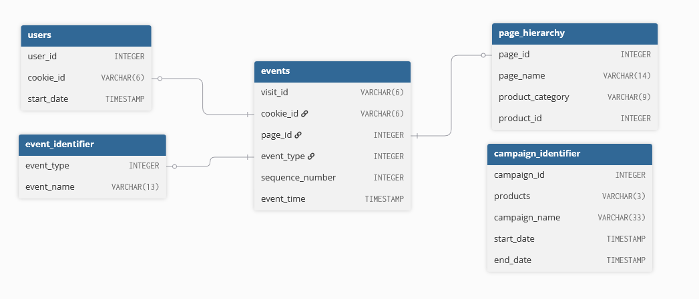

<div align="center">

# Case Study #6 - Clique Bait </br>


</div>

## 💡 Informacje

W folderze _solutions_ znajdują się pliki z rozwiązaniami w SQL.</br>
Do wykonania wykorzystany został SQL oraz PostgreSQL.</br>
Szczegółowe informacje dotyczące tego studium przypadku znajdują się [tutaj](https://8weeksqlchallenge.com/case-study-6/).

## 📋 Spis treści

- [Opis](#-opis)
- [Diagram relacji](#-diagram-relacji)
- [Rozwiązanie: 2. Digital Analysis](#️-2-digital-analysis)
  - [1. How many users are there?](#1-how-many-users-are-there)
  - [2. How many cookies does each user have on average?](#2-how-many-cookies-does-each-user-have-on-average)
  - [3. What is the unique number of visits by all users per month? ](#3-what-is-the-unique-number-of-visits-by-all-users-per-month)
  - [4. What is the number of events for each event type?](#4-what-is-the-number-of-events-for-each-event-type)
  - [5. What is the percentage of visits which have a purchase event?](#5-what-is-the-percentage-of-visits-which-have-a-purchase-event)
  - [6. What is the percentage of visits which view the checkout page but do not have a purchase event?](#6-what-is-the-percentage-of-visits-which-view-the-checkout-page-but-do-not-have-a-purchase-event)
  - [7. What are the top 3 pages by number of views?](#7-what-are-the-top-3-pages-by-number-of-views)
  - [8. What is the number of views and cart adds for each product category?](#8-what-is-the-number-of-views-and-cart-adds-for-each-product-category)
  - [9. What are the top 3 products by purchases?](#9-what-are-the-top-3-products-by-purchases)
- [Rozwiązanie: 3. Product Funnel Analysis](#️-3-product-funnel-analysis)
  - [Create tables](#️-3-product-funnel-analysis)
  - [1. Which product had the most views, cart adds and purchases?](#1-which-product-had-the-most-views-cart-adds-and-purchases)
  - [2. Which product was most likely to be abandoned?](#2-which-product-was-most-likely-to-be-abandoned)
  - [3. Which product had the highest view to purchase percentage?](#3-which-product-had-the-highest-view-to-purchase-percentage)
  - [4. What is the average conversion rate from view to cart add?](#4-what-is-the-average-conversion-rate-from-view-to-cart-add)
  - [5. What is the average conversion rate from cart add to purchase?](#5-what-is-the-average-conversion-rate-from-cart-add-to-purchase)

## 🔍 Opis

### Wprowadzenie

Danny jest założycielem i dyrektorem generalnym sklepu online z owocami morza - Clique Bait. W tym studium przypadku Twoim zadaniem jest wesprzeć wizję Danny’ego, przeanalizować jego zbiór danych oraz zaproponować kreatywne rozwiązania

## 📈 Diagram relacji

<div align=center>

</div>

Tabela 1: Users

| user_id | cookie_id |     start_date      |
| :-----: | :-------: | :-----------------: |
|   397   |  3759ff   | 2020-03-30 00:00:00 |
|   215   |  863329   | 2020-01-26 00:00:00 |
|   191   |  eefca9   | 2020-03-15 00:00:00 |
|   89    |  764796   | 2020-01-07 00:00:00 |
|   127   |  17ccc5   | 2020-01-22 00:00:00 |
|   81    |  b0b666   | 2020-03-01 00:00:00 |
|   260   |  a4f236   | 2020-01-08 00:00:00 |
|   203   |  d1182f   | 2020-04-18 00:00:00 |
|   23    |  12dbc8   | 2020-01-18 00:00:00 |
|   375   |  f61d69   | 2020-01-03 00:00:00 |

Tabela 2: Events

| visit_id | cookie_id | page_id | event_type | sequence_number |         event_time         |
| :------: | :-------: | :-----: | :--------: | :-------------: | :------------------------: |
|  719fd3  |  3d83d3   |    5    |     1      |        4        | 2020-03-02 00:29:09.975502 |
|  fb1eb1  |  c5ff25   |    5    |     2      |        8        | 2020-01-22 07:59:16.761931 |
|  23fe81  |  1e8c2d   |   10    |     1      |        9        | 2020-03-21 13:14:11.745667 |
|  ad91aa  |  648115   |    6    |     1      |        3        | 2020-04-27 16:28:09.824606 |
|  5576d7  |  ac418c   |    6    |     1      |        4        | 2020-01-18 04:55:10.149236 |
|  48308b  |  c686c1   |    8    |     1      |        5        | 2020-01-29 06:10:38.702163 |
|  46b17d  |  78f9b3   |    7    |     1      |       12        | 2020-02-16 09:45:31.926407 |
|  9fd196  |  ccf057   |    4    |     1      |        5        | 2020-02-14 08:29:12.922164 |
|  edf853  |  f85454   |    1    |     1      |        1        | 2020-02-22 12:59:07.652207 |
|  3c6716  |  02e74f   |    3    |     2      |        5        | 2020-01-31 17:56:20.777383 |

Tabela 3: Event Identifier

| event_type |  event_name   |
| :--------: | :-----------: |
|     1      |   Page View   |
|     2      |  Add to Cart  |
|     3      |   Purchase    |
|     4      | Ad Impression |
|     5      |   Ad Click    |

Tabela 4: Campaign Identifier

| campaign_id | products |           campaign_name           |     start_date      | end_date            |
| :---------: | :------: | :-------------------------------: | :-----------------: | ------------------- |
|      1      |   1-3    |  BOGOF - Fishing For Compliments  | 2020-01-01 00:00:00 | 2020-01-14 00:00:00 |
|      2      |   4-5    |   25% Off - Living The Lux Life   | 2020-01-15 00:00:00 | 2020-01-28 00:00:00 |
|      3      |   6-8    | Half Off - Treat Your Shellf(ish) | 2020-02-01 00:00:00 | 2020-03-31 00:00:00 |

Tabela 5: Page Hierarchy

|    region     | month_number | total_sales |
| :-----------: | :----------: | :---------: |
|    AFRICA     |      3       |  567767480  |
|     ASIA      |      3       |  529770793  |
|    CANADA     |      3       |  144634329  |
|    EUROPE     |      3       |  35337093   |
|    OCEANIA    |      3       |  783282888  |
| SOUTH AMERICA |      3       |  71023109   |
|      USA      |      3       |  225353043  |

</br>

## ⚙️ 2. Digital Analysis

### 1. How many users are there?

_Ilu jest użytkowników?_

```sql
SELECT
    COUNT(DISTINCT user_id) as all_users
FROM users;
```

#### Wynik zapytania/Odpowiedź:

| all_users |
| :-------: |
|    500    |

---

### 2. How many cookies does each user have on average?

_Ile plików cookie ma średnio każdy użytkownik?_

```sql
WITH cookie_cte AS(
    SELECT
        user_id,
        COUNT(cookie_id) as cookie_count
    FROM users
    GROUP BY user_id
)

SELECT
    ROUND(AVG(cookie_count),0) as avg_cookie_id
FROM cookie_cte;
```

#### Wynik zapytania/Odpowiedź:

| avg_cookie_id |
| :-----------: |
|       4       |

---

### 3. What is the unique number of visits by all users per month?

_Jaka jest unikalna liczba wizyt wszystkich użytkowników w miesiącu?_

```sql
SELECT
    DATE_PART('month', event_time) as month,
    COUNT(distinct visit_id) as unique_visits
FROM events
GROUP BY month;
```

#### Wynik zapytania/Odpowiedź:

| month | unique_visits |
| :---: | :-----------: |
|   1   |      876      |
|   2   |     1488      |
|   3   |      916      |
|   4   |      248      |
|   5   |      36       |

---

### 4. What is the number of events for each event type?

_Jaka jest liczba zdarzeń dla każdego typu zdarzenia?_

```sql
SELECT
    event_type,
    COUNT(event_type) as number_of_events
FROM events
GROUP BY event_type
ORDER BY event_type;
```

#### Wynik zapytania/Odpowiedź:

| event_type | number_of_events |
| :--------: | :--------------: |
|     1      |      20928       |
|     2      |       8451       |
|     3      |       1777       |
|     4      |       876        |
|     5      |       702        |

---

### 5. What is the percentage of visits which have a purchase event?

_Jaki jest procent wizyt, w trakcie których następuje dokonanie zakupu?_

```sql
SELECT
    COUNT(visit_id) * 100/
        (SELECT COUNT(DISTINCT visit_id) FROM events) as percentage_of_purchase
FROM events
WHERE event_type = 3;
```

#### Wynik zapytania/Odpowiedź:

| percentage_of_purchase |
| :--------------------: |
|           49           |

---

### 6. What is the percentage of visits which view the checkout page but do not have a purchase event?

_Jaki jest procent wizyt, podczas których wyświetlana jest strona płatności, ale nie następuje zakup?_

```sql
WITH session_sum_cte AS(
    SELECT
        visit_id,
        MAX(CASE WHEN page_id = 12 THEN 1 ELSE 0 END) as checkout_event,
        MAX(CASE WHEN event_type = 3 THEN 1 ELSE 0 END) as purchase_event
    FROM events
    GROUP BY visit_id
)

SELECT
    ROUND(
        COUNT(*) * 100.00 / (SELECT COUNT(DISTINCT visit_id) FROM events), 2) as percentage_from_all_visits
FROM session_sum_cte
WHERE checkout_event = 1 and purchase_event = 0;
```

#### Wynik zapytania/Odpowiedź:

| percentage_from_all_visits |
| :------------------------: |
|            9.15            |

---

### 7. What are the top 3 pages by number of views?

_Jakie są top 3 strony pod względem wyświetleń?_

```sql
SELECT
    page_name,
    COUNT(*) as number_of_visits
FROM events
LEFT JOIN page_hierarchy
    ON events.page_id = page_hierarchy.page_id
WHERE event_type = 1
GROUP BY page_name
ORDER BY number_of_visits DESC
LIMIT 3;
```

#### Wynik zapytania/Odpowiedź:

|  page_name   | number_of_visits |
| :----------: | :--------------: |
| All Products |       3174       |
|   Checkout   |       2103       |
|  Home Page   |       1782       |

---

### 8. What is the number of views and cart adds for each product category?

_Jaka jest liczba wyświetleń i dodanych do koszyka produktów dla każdej kategorii?_

```sql
SELECT
    product_category,
    SUM(1) FILTER(WHERE event_type = 1) as number_of_views,
    SUM(1) FILTER(WHERE event_type = 2) as number_of_add
FROM events
JOIN page_hierarchy
    ON events.page_id = page_hierarchy.page_id
WHERE product_category IS NOT NULL
GROUP BY product_category;
```

#### Wynik zapytania/Odpowiedź:

| product_category | number_of_views | number_of_add |
| :--------------: | :-------------: | :-----------: |
|      Luxury      |      3032       |     1870      |
|    Shellfish     |      6204       |     3792      |
|       Fish       |      4633       |     2789      |

---

### 9. What are the top 3 products by purchases?

_Jakie są top 3 produkty pod względem zakupów?_

```sql
SELECT
    page_name,
    COUNT(*) AS purchases_count
FROM events
INNER JOIN page_hierarchy
    ON events.page_id = page_hierarchy.page_id
WHERE event_type = 2
    AND visit_id IN (
        SELECT
            visit_id
        FROM events
        WHERE event_type = 3
    )
GROUP BY page_name
ORDER BY purchases_count DESC
LIMIT 3;
```

#### Wynik zapytania/Odpowiedź:

| page_name | purchases_count |
| :-------: | :-------------: |
|  Lobster  |       754       |
|  Oyster   |       726       |
|   Crab    |       719       |

#### Wyjaśnienie:

Trudność w tym zadaniu polegała na tym, że `purchases_count` to jedynie liczba, ile razy product o danej nazwie znajdował się w koszyku, gdyż nie jest podana ilość zakupionego produktu. W rzeczywistości wyniki mogłyby być zupełnie inne, ponieważ w danym koszyku mogłyby się znaleźć np. 3x krab czy 20x ostryga, a w tym przypadku są liczone jako pojedyncze sztuki.

---

## ⚙️ 3. Product Funnel Analysis

Stworzenie nowej tabli, która ma wyglądać następująco:
| Kolumna | Opis |
| ---: | :--- |
| produkt | Nazwa produktu |
| views | Liczba wyświetlań każdego produktu |
| add_card | Liczba dodania produktu do koszyka |
| abandoned | Liczba porzuceń zamówienia |
| purchased | Liczba zakupienia produktu |

```sql
WITH product_status_cte AS(
    SELECT
        page_name,
        SUM(1) FILTER (WHERE event_type = 1) as views,
        SUM(1) FILTER (WHERE event_type = 2) as add_card,
        CASE
            WHEN visit_id IN(
                SELECT
                    visit_id
                FROM events
                WHERE event_type = 3
            ) THEN 1 ELSE 0
        END as is_purchased
    FROM events as e
    INNER JOIN page_hierarchy AS ph
        ON e.page_id = ph.page_id
    WHERE product_id IS NOT NULL
    GROUP BY page_name, visit_id
)

SELECT
    page_name,
    SUM(views) as views,
    SUM(add_card) as add_card,
    SUM(1) FILTER (WHERE add_card = 1 AND is_purchased = 0) as abandoned,
    SUM(1) FILTER (WHERE add_card = 1 AND is_purchased = 1) as purchased
FROM product_status_cte
GROUP BY page_name;
```

#### Wynik zapytania:

|   page_name    | views | add_card | abandoned | purchased |
| :------------: | :---: | :------: | :-------: | :-------: |
|    Abalone     | 1525  |   932    |    233    |    699    |
| Black Truffle  | 1469  |   924    |    217    |    707    |
|      Crab      | 1564  |   949    |    230    |    719    |
|    Kingfish    | 1559  |   920    |    213    |    707    |
|    Lobster     | 1547  |   968    |    214    |    754    |
|     Oyster     | 1568  |   943    |    217    |    726    |
| Russian Caviar | 1563  |   946    |    249    |    697    |
|     Salmon     | 1559  |   938    |    227    |    711    |
|      Tuna      | 1515  |   931    |    234    |    697    |

Następnie stworzenie drugiej tabeli, ale tym razem dla kategorii produktów, a nie samych produktów, zapytanie SQL będzie wyglądać tak samo, jedynie zamiast `page_name` użyte będzie `product_category`

#### Wynik zapytania:

| product_category | views | add_card | abandoned | purchased |
| :--------------: | :---: | :------: | :-------: | :-------: |
|      Luxury      | 3032  |   1870   |    310    |    758    |
|    Shellfish     | 6204  |   3792   |    296    |    591    |
|       Fish       | 4633  |   2789   |    316    |    707    |

### 1. Which product had the most views, cart adds and purchases?

_Który produkt miał najwięcej 'views', 'card_adds' i 'purchases`?_

```sql
SELECT
    (SELECT page_name FROM product_summary_view ORDER BY views DESC LIMIT 1) as most_views,
    (SELECT page_name FROM product_summary_view ORDER BY add_card DESC LIMIT 1) as most_adds,
    (SELECT page_name FROM product_summary_view ORDER BY purchased DESC LIMIT 1) as most_purchases
```

#### Wynik zapytania/Odpowiedź:

| most_views | most_adds | most_purchases |
| :--------: | :-------: | :------------: |
|   Oyster   |  Lobster  |    Lobster     |

---

### 2. Which product was most likely to be abandoned?

_Który produkt najczęściej był porzucany?_

```sql
SELECT
    page_name,
    abandoned as most_abandoned
FROM product_summary_view
ORDER BY abandoned DESC
LIMIT 1;
```

#### Wynik zapytania/Odpowiedź:

|   page_name    | most_abandoned |
| :------------: | :------------: |
| Russian Caviar |      249       |

---

### 3. Which product had the highest view to purchase percentage?

_Który produkt miał najwyższy wskaźnik sprzedaży do wyświetleń?_

```sql
SELECT
    page_name,
    ROUND(purchased * 100.0 / views, 1) as view_to_purchase_rate
FROM product_summary_view
ORDER BY view_to_purchase_rate DESC
LIMIT 1;
```

#### Wynik zapytania/Odpowiedź:

| page_name | view_to_purchas... |
| :-------: | :----------------: |
|  Lobster  |        48.7        |

---

### 4. What is the average conversion rate from view to cart add?

_Jaki jest średni współczynnik konwersji od obejrzenia do dodania do koszyka?_

```sql
SELECT
  ROUND(AVG(100.00 * add_card / views), 2) AS avg_view_to_cart_rate
FROM product_summary_view;
```

#### Wynik zapytania/Odpowiedź:

| avg_view_to_cart_rate |
| :-------------------: |
|         60.95         |

---

### 5. What is the average conversion rate from cart add to purchase?

_Jaki jest średni współczynnik konwersji od dodania do koszyka do zakupu?_

```sql
SELECT
  ROUND(AVG(100.0 * purchased / add_card), 2) AS avg_cart_to_purchase_rate
FROM product_summary_view;
```

#### Wynik zapytania/Odpowiedź:

| avg_cart_to_purchase_rate |
| :-----------------------: |
|           75.93           |

---
