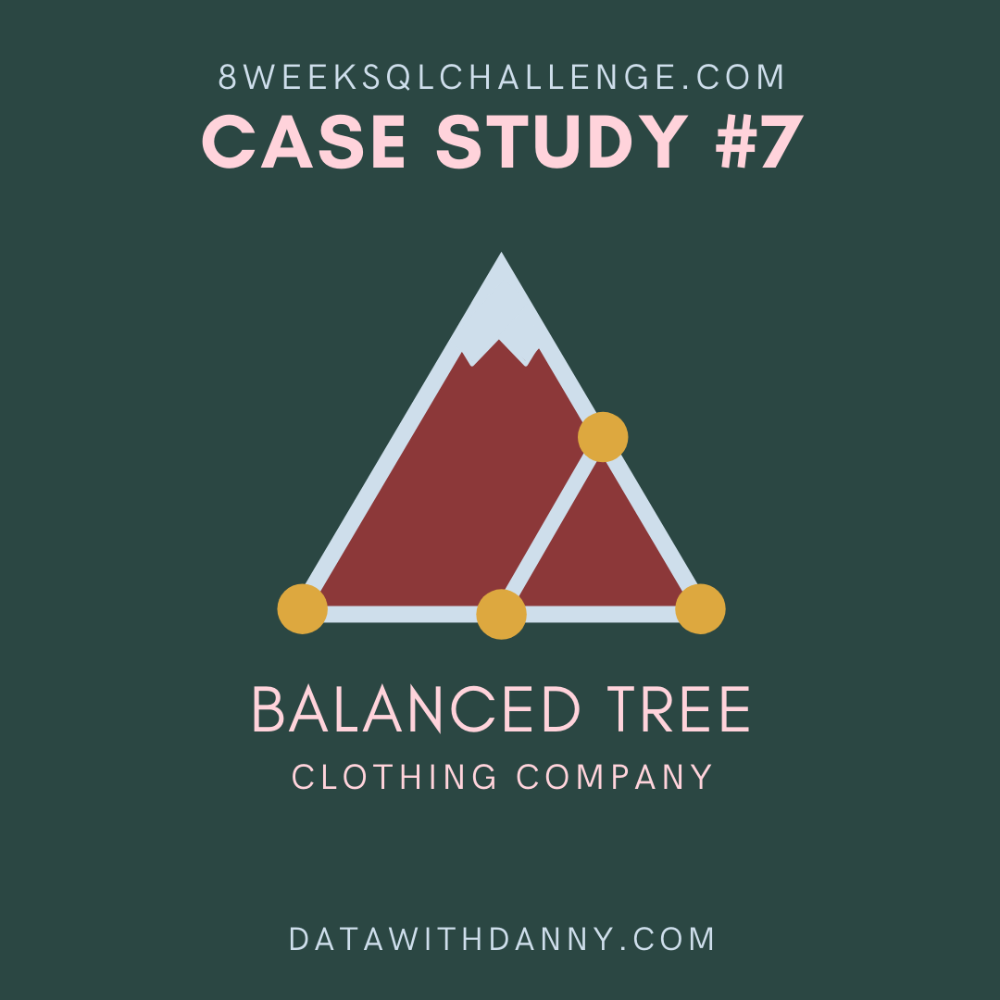
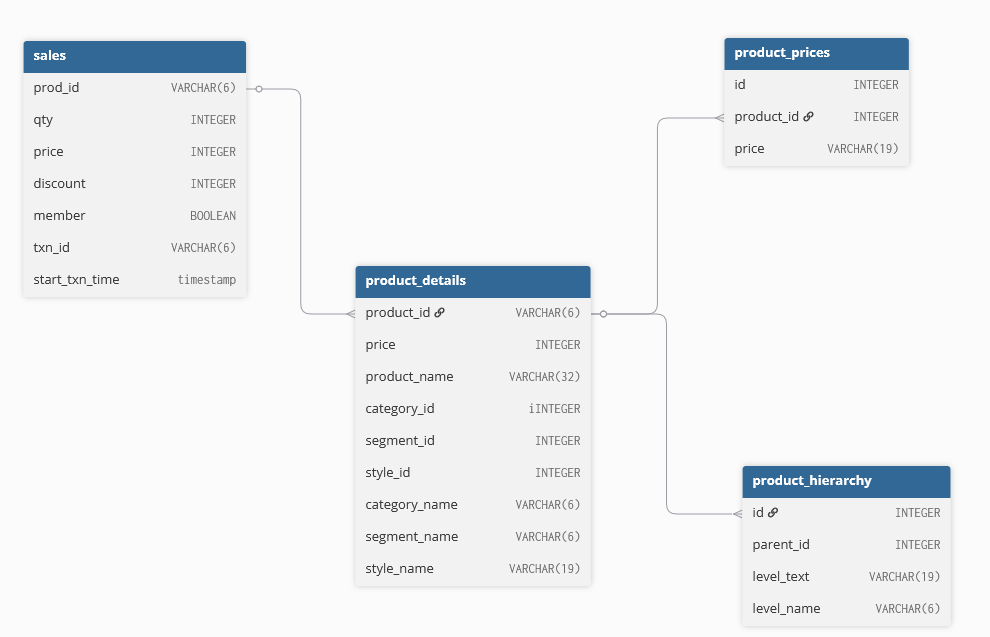

<div align="center">

# Case Study #7 - Balanced Tree Clothing Co. </br>


</div>

## 💡 Informacje

W folderze _solutions_ znajdują się pliki z rozwiązaniami w SQL.</br>
Do wykonania wykorzystany został SQL oraz PostgreSQL.</br>
Szczegółowe informacje dotyczące tego studium przypadku znajdują się [tutaj](https://8weeksqlchallenge.com/case-study-7/).

## 📋 Spis treści

- [Opis](#-opis)
- [Diagram relacji](#-diagram-relacji)
- [Rozwiązanie: 1. High Level Sales Analysis](#️-1-high-level-sales-analysis)
- [Rozwiązanie: 2. Transaction Analysis](#️-2-transaction-analysis)
- [Rozwiązanie: 3. Product Analysis](#️-3-product-analysis)

## 🔍 Opis

### Wprowadzenie

Balanced Tree Clothing Company szczyci się tym, że zapewnia zoptymalizowaną gamę odzieży dla współczesnego poszukiwacza przygód!

Danny, dyrektor generalny tej modnej firmy odzieżowej, poprosił o pomoc w analizie ich wyników sprzedaży i wygenerowaniu podstawowego raportu finansowego, którym możesz podzielić się z szerszym biznesem.

## 📈 Diagram relacji

<div align=center>

</div>

## ⚙️ 1. High Level Sales Analysis

### 1. What was the total quantity sold for all products?

### 2. What is the total generated revenue for all products before discounts?

### 3. What was the total discount amount for all products?

_Jaka była całkowita sprzedana ilość wszystkich produktów?_ </br>
_Jaki jest całkowity przychód wygenerowany dla wszystkich produktów przed rabatami?_ </br>
_Jaka była łączna kwota rabatu na wszystkie produkty?_ </br>

```sql
SELECT
    SUM(qty) as total_quantity,
    SUM(qty * price) as total_revenue_before_discounts,
    ROUND(SUM(qty * price * (discount / 100.0)), 2) as total_discount_amount
FROM sales;
```

#### Wynik zapytania/Odpowiedź:

| total_quantity | total_revenue_before_discounts | total_discount_amount |
| :------------: | :----------------------------: | :-------------------: |
|     45216      |            1289453             |       156229.14       |

---

## ⚙️ 2. Transaction Analysis

### 1. How many unique transactions were there?

### 2. What is the average unique products purchased in each transaction?

### 3. What are the 25th, 50th and 75th percentile values for the revenue per transaction?

### 4. What is the average discount value per transaction?

### 5. What is the percentage split of all transactions for members vs non-members?

### 6. What is the average revenue for member transactions and non-member transactions?

_Ile było unikalnych transakcji?_ </br>
_Jaka jest średnia liczba unikalnych produktów zakupionych w każdej transakcji?_ </br>
_Jakie są wartości 25., 50. i 75. percentyla przychodu z transakcji?_ </br>
_Jaka jest średnia wartość rabatu na transakcję?_ </br>
_Jaki jest procentowy podział wszystkich transakcji dla członków i osób niebędących członkami?_ </br>
_Jaki jest średni przychód z transakcji członków i transakcji osób niebędących członkami?_ </br>

```sql

-- Q1. How many unique transactions were there?
SELECT
    COUNT(DISTINCT txn_id) as unique_transaction
FROM sales;

-- Q2. What is the average unique products purchased in each transaction?

WITH products_count_cte AS(
    SELECT
        txn_id,
        COUNT(DISTINCT prod_id) as products_per_transaction
    FROM sales
    GROUP BY txn_id
)

SELECT
    ROUND(AVG(products_per_transaction)) as average_unique_products
FROM products_count_cte;

-- Q3. What are the 25th, 50th and 75th percentile values for the revenue per transaction?

WITH txn_revenue_cte AS(
    SELECT
        txn_id,
        SUM(price * qty) as total_revenue
    FROM sales
    GROUP BY txn_id
)

SELECT
    PERCENTILE_CONT(0.25) WITHIN GROUP (ORDER BY total_revenue) as percentile_25,
    PERCENTILE_CONT(0.50) WITHIN GROUP (ORDER BY total_revenue) as percentile_50,
    PERCENTILE_CONT(0.75) WITHIN GROUP (ORDER BY total_revenue) as percentile_75
FROM txn_revenue_cte;

-- Q4. What is the average discount value per transaction?

WITH discount_per_transaction_cte AS(
    SELECT
        txn_id,
        SUM(price * qty * (discount / 100.0)) as discount_value
    FROM sales
    GROUP BY txn_id
)
SELECT
    ROUND(AVG(discount_value), 2) as avg_discount_value
FROM discount_per_transaction_cte;

-- Q5. What is the percentage split of all transactions for members vs non-members?

SELECT
    ROUND(COUNT(DISTINCT txn_id) FILTER (WHERE member = 'f') * 100.0 /COUNT(DISTINCT txn_id)) as number_of_non_member,
    ROUND(COUNT(DISTINCT txn_id) FILTER (WHERE member = 't') * 100.0 /COUNT(DISTINCT txn_id)) as number_of_member
FROM sales;

-- Q6. What is the average revenue for member transactions and non-member transactions?

WITH total_revenue_cte AS(
    SELECT
        member,
        txn_id,
        SUM(price * qty) as revenue
    FROM sales
    GROUP BY member, txn_id
)
SELECT
    member,
    ROUND(AVG(revenue), 2) as avg_revenue
FROM total_revenue_cte
GROUP BY member

```

#### Wynik zapytania 1:

| unique_transaction |
| :----------------: |
|        2500        |

#### Wynik zapytania 2:

| average_unique_products |
| :---------------------: |
|            6            |

#### Wynik zapytania 3:

| percentile_25 | percentile_50 | percentile_75 |
| :-----------: | :-----------: | :-----------: |
|    375.75     |     509.5     |      647      |

#### Wynik zapytania 4:

| avg_discount_value |
| :----------------: |
|       62.49        |

#### Wynik zapytania 5:

| number_of_non_member | number_of_member |
| :------------------: | :--------------: |
|          40          |        60        |

#### Wynik zapytania 6:

| member | avg_revenue |
| :----: | :---------: |
| FALSE  |   515.04    |
|  TRUE  |   516.27    |

## ⚙️ 3. Product Analysis

### 1. What are the top 3 products by total revenue before discount?

### 2. What is the total quantity, revenue and discount for each segment?

### 3. What is the top selling product for each segment?

### 4. What is the total quantity, revenue and discount for each category?

### 5. What is the top selling product for each category?

### 6. What is the percentage split of revenue by product for each segment?

### 7. What is the percentage split of revenue by segment for each category?

### 8. What is the percentage split of total revenue by category?

### 9. What is the total transaction “penetration” for each product?

### 10. What is the most common combination of at least 1 quantity of any 3 products in a 1 single transaction?

_Jakie są 3 najlepsze produkty pod względem całkowitego przychodu przed rabatem?_
_Jaka jest całkowita ilość, przychód i rabat dla każdego segmentu?_
_Który produkt jest najlepiej sprzedającym się produktem w każdym segmencie?_
_Jaka jest całkowita ilość, przychód i rabat dla każdej kategorii?_
_Który produkt jest najlepiej sprzedającym się produktem w każdej kategorii?_
_Jaki jest procentowy podział przychodów według produktów w każdym segmencie?_
_Jaki jest procentowy podział przychodów według segmentów dla każdej kategorii?_
_Jaki jest procentowy podział całkowitych przychodów według kategorii?_
_Jaka jest całkowita „penetracja” transakcji dla każdego produktu?_
_Jaka jest najczęstsza kombinacja co najmniej jednej ilości 3 dowolnych produktów w ramach jednej transakcji?_

```sql


-- Q1 What are the top 3 products by total revenue before discount?

SELECT
    product_name,
    SUM(sales.price * qty) as total_revenue
FROM sales
LEFT JOIN product_details
    ON sales.prod_id = product_details.product_id
GROUP BY product_name
ORDER BY total_revenue DESC
LIMIT 3;

-- Q2 What is the total quantity, revenue and discount for each segment?

SELECT
    pd.segment_name,
    SUM(sales.qty) as total_quantity,
    SUM(sales.price * sales.qty) as total_revenue,
    ROUND(SUM(sales.price * sales.qty * sales.discount / 100.0), 2) as total_discount
FROM sales
INNER JOIN product_details pd
    ON sales.prod_id = pd.product_id
GROUP BY segment_name;

-- Q3 What is the top selling product for each segment?

WITH ranked_product_cte AS(
    SELECT
        pd.segment_name,
        pd.product_name,
        SUM(sales.qty) as total_quantity,
        DENSE_RANK() OVER
            (PARTITION BY  segment_name
            ORDER BY SUM(sales.qty) DESC) as rank
    FROM sales
    INNER JOIN product_details pd
        ON sales.prod_id = pd.product_id
    GROUP BY segment_name, product_name
)

SELECT
    segment_name,
    product_name,
    total_quantity
FROM ranked_product_cte
WHERE rank = 1;

-- Q4 What is the total quantity, revenue and discount for each category?

SELECT
    pd.category_name,
    SUM(sales.qty) as total_quantity,
    SUM(sales.price * sales.qty) as total_revenue,
    ROUND(SUM(sales.price * sales.qty * sales.discount / 100.0), 2) as total_discount
FROM sales
INNER JOIN product_details pd
    ON sales.prod_id = pd.product_id
GROUP BY pd.category_name;

-- Q5 What is the top selling product for each category?

WITH ranked_product_cte AS(
    SELECT
        pd.category_name,
        pd.product_name,
        SUM(sales.qty) as total_quantity,
        DENSE_RANK() OVER
            (PARTITION BY  category_name
            ORDER BY SUM(sales.qty) DESC) as rank
    FROM sales
    INNER JOIN product_details pd
        ON sales.prod_id = pd.product_id
    GROUP BY category_name, product_name
)

SELECT
    category_name,
    product_name,
    total_quantity
FROM ranked_product_cte
WHERE rank = 1;

-- Q6 What is the percentage split of revenue by product for each segment?

WITH product_revenue_cte AS (
    SELECT
        pd.segment_name,
        pd.product_name,
        SUM(s.qty * s.price) as prod_revenue
    FROM sales s
    INNER JOIN product_details pd ON s.prod_id = pd.product_id
    GROUP BY pd.segment_name, pd.product_name
)
SELECT
    segment_name,
    product_name,
    prod_revenue,
    ROUND(100.0 * prod_revenue / SUM(prod_revenue) OVER (PARTITION BY segment_name), 2) as percentage_revenue
FROM product_revenue_cte
ORDER BY segment_name, percentage_revenue DESC;

-- Q7 What is the percentage split of revenue by segment for each category?

WITH segment_revenue_cte AS (
    SELECT
        pd.category_name,
        pd.segment_name,
        SUM(s.qty * s.price) as seg_revenue
    FROM sales s
    INNER JOIN product_details pd ON s.prod_id = pd.product_id
    GROUP BY pd.category_name, pd.segment_name
)
SELECT
    category_name,
    segment_name,
    seg_revenue,
    ROUND(100.0 * seg_revenue / SUM(seg_revenue) OVER (PARTITION BY category_name), 2) as percentage_revenue
FROM segment_revenue_cte
ORDER BY category_name, percentage_revenue DESC;

-- Q8 What is the percentage split of total revenue by category?

WITH category_revenue_cte AS (
    SELECT
        pd.category_name,
        SUM(s.qty * s.price) as categ_revenue
    FROM sales s
    INNER JOIN product_details pd ON s.prod_id = pd.product_id
    GROUP BY pd.category_name
)
SELECT
    category_name,
    categ_revenue,
    ROUND(100.0 * categ_revenue / (SELECT SUM(qty * price) FROM sales), 2) as percentage_revenue
FROM category_revenue_cte
ORDER BY category_name, percentage_revenue DESC;

-- Q9 What is the total transaction “penetration” for each product? (hint: penetration = number of transactions where at least 1 quantity of a product was purchased divided by total number of transactions)

SELECT
    pd.product_name,
    COUNT(DISTINCT s.txn_id) as product_transactions,
    ROUND(100.0 * COUNT(DISTINCT s.txn_id) / (SELECT COUNT(DISTINCT txn_id) FROM sales), 2) as penetration_percentage
FROM sales s
JOIN product_details pd ON s.prod_id = pd.product_id
GROUP BY pd.product_name
ORDER BY penetration_percentage DESC;

-- Q10 What is the most common combination of at least 1 quantity of any 3 products in a 1 single transaction?

SELECT
    pd1.product_name AS product_1,
    pd2.product_name AS product_2,
    pd3.product_name AS product_3,
    COUNT(*) AS times_bought_together
FROM sales s1
JOIN sales s2 ON s1.txn_id = s2.txn_id AND s1.prod_id < s2.prod_id
JOIN sales s3 ON s2.txn_id = s3.txn_id AND s2.prod_id < s3.prod_id
JOIN product_details pd1 ON s1.prod_id = pd1.product_id
JOIN product_details pd2 ON s2.prod_id = pd2.product_id
JOIN product_details pd3 ON s3.prod_id = pd3.product_id
GROUP BY pd1.product_name, pd2.product_name, pd3.product_name
ORDER BY times_bought_together DESC
LIMIT 1;
```

#### Wynik zapytania 1:

|         product_name         | total_revenue |
| :--------------------------: | :-----------: |
|    Blue Polo Shirt - Mens    |    217683     |
| Grey Fashion Jacket - Womens |    209304     |
|    White Tee Shirt - Mens    |    152000     |

#### Wynik zapytania 2:

| segment_name | total_quantity | total_revenue | total_discount |
| :----------: | :------------: | :-----------: | :------------: |
|    Shirt     |     11265      |    406143     |    49594.27    |
|    Jeans     |     11349      |    208350     |    25343.97    |
|    Jacket    |     11385      |    366983     |    44277.46    |
|    Socks     |     11217      |    307977     |    37013.44    |

#### Wynik zapytania 3:

| segment_name |         product_name          | total_quantity |
| :----------: | :---------------------------: | :------------: |
|    Jacket    | Grey Fashion Jacket - Womens  |      3876      |
|    Jeans     | Navy Oversized Jeans - Womens |      3856      |
|    Shirt     |    Blue Polo Shirt - Mens     |      3819      |
|    Socks     |    Navy Solid Socks - Mens    |      3792      |

#### Wynik zapytania 4:

| category_name | total_quantity | total_revenue | total_discount |
| :-----------: | :------------: | :-----------: | :------------: |
|     Mens      |     22482      |    714120     |    86607.71    |
|    Womens     |     22734      |    575333     |    69621.43    |

#### Wynik zapytania 5:

| category_name |         product_name         | total_quantity |
| :-----------: | :--------------------------: | :------------: |
|     Mens      |    Blue Polo Shirt - Mens    |      3819      |
|    Womens     | Grey Fashion Jacket - Womens |      3876      |

#### Wynik zapytania 6:

| segment_name |           product_name           | prod_revenue | percentage_reve... |
| :----------: | :------------------------------: | :----------: | :----------------: |
|    Jacket    |   Grey Fashion Jacket - Womens   |    209304    |       57.03        |
|    Jacket    |    Khaki Suit Jacket - Womens    |    86296     |       23.51        |
|    Jacket    |   Indigo Rain Jacket - Womens    |    71383     |       19.45        |
|    Jeans     |  Black Straight Jeans - Womens   |    121152    |       58.15        |
|    Jeans     |  Navy Oversized Jeans - Womens   |    50128     |       24.06        |
|    Jeans     |   Cream Relaxed Jeans - Womens   |    37070     |       17.79        |
|    Shirt     |      Blue Polo Shirt - Mens      |    217683    |       53.60        |
|    Shirt     |      White Tee Shirt - Mens      |    152000    |       37.43        |
|    Shirt     |   Teal Button Up Shirt - Mens    |    36460     |        8.98        |
|    Socks     |     Navy Solid Socks - Mens      |    136512    |       44.33        |
|    Socks     | Pink Fluro Polkadot Socks - Mens |    109330    |       35.50        |
|    Socks     |    White Striped Socks - Mens    |    62135     |       20.18        |

#### Wynik zapytania 7:

| category_name | segment_name | seg_revenue | percentage_reve... |
| :-----------: | :----------: | :---------: | :----------------: |
|     Mens      |    Shirt     |   406143    |       56.87        |
|     Mens      |    Socks     |   307977    |       43.13        |
|    Womens     |    Jacket    |   366983    |       63.79        |
|    Womens     |    Jeans     |   208350    |       36.21        |

#### Wynik zapytania 8:

| segment_name |           product_name           | prod_revenue | percentage_reve... |
| :----------: | :------------------------------: | :----------: | :----------------: |
|    Jacket    |   Grey Fashion Jacket - Womens   |    209304    |       57.03        |
|    Jacket    |    Khaki Suit Jacket - Womens    |    86296     |       23.51        |
|    Jacket    |   Indigo Rain Jacket - Womens    |    71383     |       19.45        |
|    Jeans     |  Black Straight Jeans - Womens   |    121152    |       58.15        |
|    Jeans     |  Navy Oversized Jeans - Womens   |    50128     |       24.06        |
|    Jeans     |   Cream Relaxed Jeans - Womens   |    37070     |       17.79        |
|    Shirt     |      Blue Polo Shirt - Mens      |    217683    |       53.60        |
|    Shirt     |      White Tee Shirt - Mens      |    152000    |       37.43        |
|    Shirt     |   Teal Button Up Shirt - Mens    |    36460     |        8.98        |
|    Socks     |     Navy Solid Socks - Mens      |    136512    |       44.33        |
|    Socks     | Pink Fluro Polkadot Socks - Mens |    109330    |       35.50        |
|    Socks     |    White Striped Socks - Mens    |    62135     |       20.18        |

#### Wynik zapytania 9:

|           product_name           | product_transactions | penetration_percentage |
| :------------------------------: | :------------------: | :--------------------: |
|     Navy Solid Socks - Mens      |         1281         |         51.24          |
|   Grey Fashion Jacket - Womens   |         1275         |         51.00          |
|  Navy Oversized Jeans - Womens   |         1274         |         50.96          |
|      White Tee Shirt - Mens      |         1268         |         50.72          |
|      Blue Polo Shirt - Mens      |         1268         |         50.72          |
| Pink Fluro Polkadot Socks - Mens |         1258         |         50.32          |
|   Indigo Rain Jacket - Womens    |         1250         |         50.00          |
|    Khaki Suit Jacket - Womens    |         1247         |         49.88          |
|  Black Straight Jeans - Womens   |         1246         |         49.84          |
|   Cream Relaxed Jeans - Womens   |         1243         |         49.72          |
|    White Striped Socks - Mens    |         1243         |         49.72          |
|   Teal Button Up Shirt - Mens    |         1242         |         49.68          |

#### Wynik zapytania 10:

|       product_1        |          product_2           |          product_3          | times_bought_t... |
| :--------------------: | :--------------------------: | :-------------------------: | :---------------: |
| White Tee Shirt - Mens | Grey Fashion Jacket - Womens | Teal Button Up Shirt - Mens |        352        |
