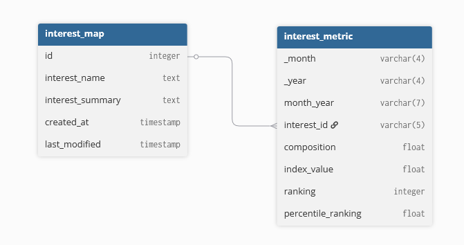

<div align="center">

# Case Study #8 - Fresh Segments </br>


</div>

## 💡 Informacje

W folderze _solutions_ znajdują się pliki z rozwiązaniami w SQL.</br>
Do wykonania wykorzystany został SQL oraz PostgreSQL.</br>
Szczegółowe informacje dotyczące tego studium przypadku znajdują się [tutaj](https://8weeksqlchallenge.com/case-study-7/).

## 📋 Spis treści

- [Opis](#-opis)
- [Diagram relacji](#-diagram-relacji)
- [Rozwiązanie: 1. High Level Sales Analysis](#️-1-high-level-sales-analysis)
- [Rozwiązanie: 2. Transaction Analysis](#️-2-transaction-analysis)
- [Rozwiązanie: 3. Product Analysis](#️-3-product-analysis)

## 🔍 Opis

### Wprowadzenie

Danny stworzył Fresh Segments - agencję marketingu cyfrowego, która pomaga innym firmom analizować trendy w zachowaniu kliknięć reklam online dla ich unikalnej bazy klientów.

Klienci udostępniają swoje listy klientów zespołowi Fresh Segments, którzy następnie agregują wskaźniki zainteresowania i generują pojedyncze dane o wartości metryk do dalszej analizy.

Danny poprosił o pomoc w analizie zagregowanych wskaźników dla przykładowego klienta i dostarczył pewnych wglądów na wysokim poziomie na temat listy klientów i ich zainteresowań.

## 📈 Diagram relacji

<div align=center>

</div>

## ⚙️ 1. Data Exploration and Cleansing

### 1. Update the fresh_segments.interest_metrics table by modifying the month_year column to be a date data type with the start of the month

_Zaktualizuj tabelę `interest_metrics`, modyfikując kolumnę month_year, tak aby zawierała typ danych daty z początkiem miesiąca_

```sql
ALTER TABLE interest_metrics
ALTER COLUMN month_year TYPE date
USING to_date(month_year, 'MM-YYYY')
```

---

### 2. What is count of records in the fresh_segments.interest_metrics for each month_year value sorted in chronological order (earliest to latest) with the null values appearing first?

_Jaka jest liczba rekordów w fresh_segments.interest_metrics dla każdej wartości month_year posortowanych w kolejności chronologicznej (od najwcześniejszego do najpóźniejszego), przy czym wartości null pojawiają się jako pierwsze?_

```sql
SELECT
    month_year,
    COUNT(*) as count_of_records
FROM interest_metrics
GROUP BY month_year
ORDER BY month_year NULLS FIRST;
```

#### Wynik zapytania/Odpowiedź:

| month_year | count_of_records |
| :--------: | :--------------: |
|    NULL    |       1194       |
| 2018-07-01 |       729        |
| 2018-08-01 |       767        |
| 2018-09-01 |       780        |
| 2018-10-01 |       857        |
| 2018-11-01 |       928        |
| 2018-12-01 |       995        |
| 2019-01-01 |       973        |
| 2019-02-01 |       1121       |
| 2019-03-01 |       1136       |
| 2019-04-01 |       1099       |
| 2019-05-01 |       857        |
| 2019-06-01 |       824        |
| 2019-07-01 |       864        |
| 2019-08-01 |       1149       |

---

### 3. What do you think we should do with these null values in the fresh_segments.interest_metrics?

_Co Twoim zdaniem powinniśmy zrobić z tymi wartościami null w fresh_segments.interest_metrics?_

Wartości NULL w kolumnie `month-year` to aż 1194 rekordy, analizując bazę danych oraz wiersze z tymi wartościami okazuje się, że dla `interest_id` jest tylko jeden rekord posiadający NULL, w reszcie przypadków rekordów nawet `interest_id` nie ma wartości. Podobnie w przypadku kolumn z datami.</br>
W tym przypadku zalecane byłoby je usunąć ze względu na to, że nie będzie można ich przypasować do drugiej tabeli z opisami aktywności klientów oraz wyciągnąć z nich pożytecznych wniosków analitycznych.

---

### 4. How many interest_id values exist in the fresh_segments.interest_metrics table but not in the fresh_segments.interest_map table? What about the other way around?

_Ile wartości interest_id znajduje się w tabeli fresh_segments.interest_metrics, a ile w tabeli fresh_segments.interest_map? A co w odwrotnej sytuacji?_

```sql
SELECT
    COUNT(DISTINCT interest_id) as count_no_in_map
FROM interest_metrics
LEFT JOIN interest_map
    ON interest_metrics.interest_id::INTEGER = interest_map.id
WHERE id IS NULL;

SELECT
    COUNT(DISTINCT id) as count_no_in_metrics
FROM interest_map
LEFT JOIN interest_metrics
    ON interest_metrics.interest_id::INTEGER = interest_map.id
WHERE interest_id IS NULL;
```

#### Wynik zapytania/Odpowiedź:

| count_no_in_map |
| :-------------: |
|        0        |

| count_no_in_metrics |
| :-----------------: |
|          7          |

---

### 5. Summarise the id values in the fresh_segments.interest_map by its total record count in this table

_Podsumuj wartości id w fresh_segments.interest_map według całkowitej liczby rekordów w tej tabeli_

```sql
SELECT
    id,
    interest_name,
    COUNT(*) as total_count
FROM interest_map
INNER JOIN interest_metrics
    ON interest_map.id = interest_metrics.interest_id::integer
GROUP BY id, interest_name
ORDER BY total_count DESC;
```

#### Przykładowe wyniki:

|  id   |            interest_name             | total_count |
| :---: | :----------------------------------: | :---------: |
| 19630 |        Toyota Vehicle Shopper        |     14      |
| 5929  | Employee Management & HR Researchers |     14      |
|  171  |            Shoe Shoppers             |     14      |
| 6107  |     Ski House Second Home Owners     |     14      |
| 19592 |           Cigars Shoppers            |     14      |
| 10008 |   Japanese Luxury Car Enthusiasts    |     14      |
| 6340  |   Kitchen and Home Goods Shoppers    |     14      |
| 6171  |       High-End Camera Shoppers       |     14      |

---

<!--

### 1.

__

```sql

```

#### Wynik zapytania/Odpowiedź:

---

-->
